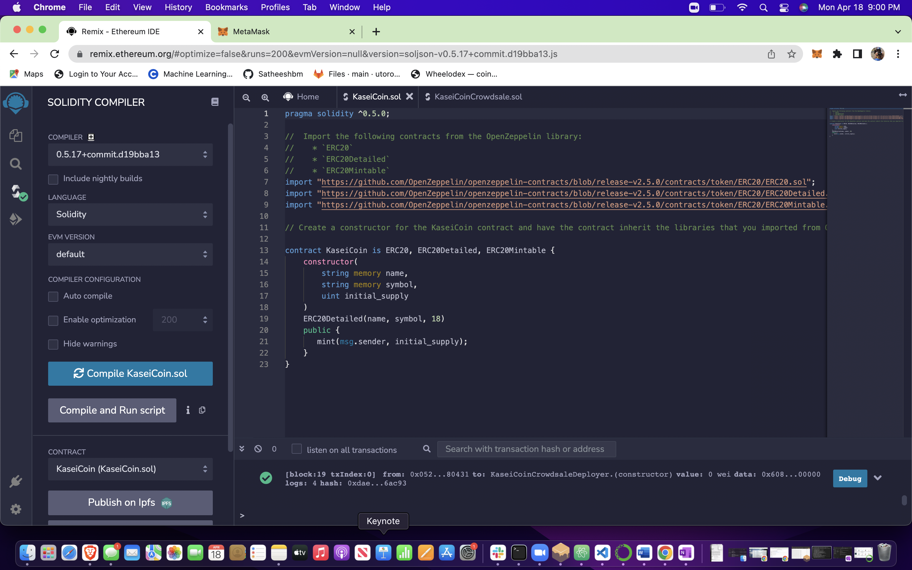

# Martian Token Crowdsale

## Background

After waiting for years and passing several tests, the Martian Aerospace Agency opened up its first human colony on Mars. As a prominent fintech professional, we were to lead a project developing a monetary system for the new Mars colony. It was decided to base this new system on blockchain technology and to define a new cryptocurrency named **KaseiCoin**. (Kasei means Mars in Japanese.)

KaseiCoin will be a fungible token that’s ERC-20 compliant. We will launch a crowdsale that will allow people who are moving to Mars to convert their earthling money to KaseiCoin.

## Instructions

The steps in which this was proceeded is as below:

1. Create the KaseiCoin Token Contract

2. Create the KaseiCoin Crowdsale Contract

3. Create the KaseiCoin Deployer Contract

4. Deploy and Test the Crowdsale on a Local Blockchain

## Evaluation Evidence:

# Compilation of KaseiCoin

# Compilation of KaseiCoin Crowdsale

# Screen recording of the deployment - available in the images folder

© 2021 Trilogy Education Services, a 2U, Inc. brand. All Rights Reserved.
